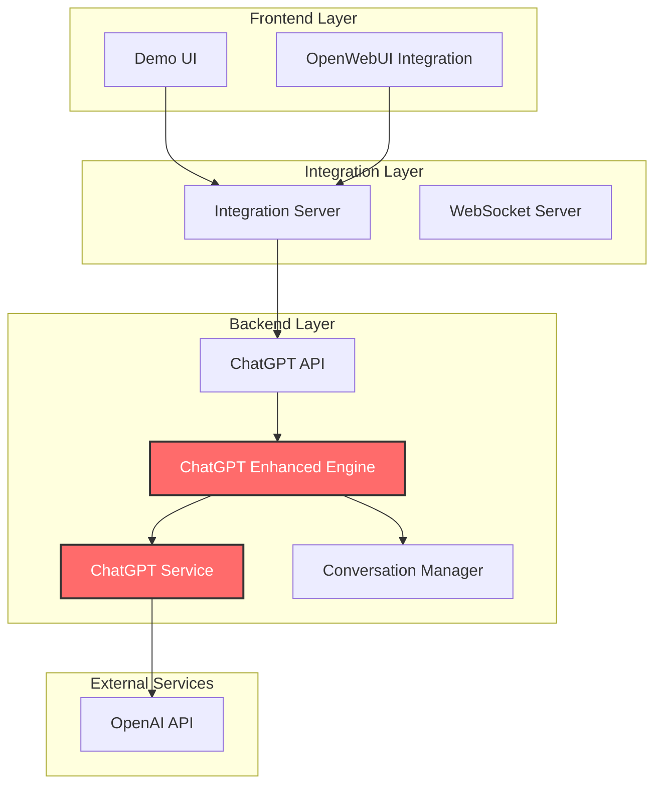

# 🚀 Context-Aware Conversational Ad Relevance Engine

**Powered by OpenAI ChatGPT - Dynamic AI Conversations with Intelligent Ad Suggestions**

A sophisticated Java-based system that integrates ChatGPT for natural conversations while intelligently suggesting relevant advertisements based on conversation context, user intent, and mood analysis.

## ✨ Features

### 🤖 **ChatGPT-Powered Conversations**
- **Natural AI Conversations**: ChatGPT engages in human-like conversations
- **Context Awareness**: Understands conversation history and user state
- **Dynamic Responses**: Generates contextual, intelligent responses
- **No Mock Data**: Uses only real ChatGPT API for all interactions

### 🎯 **Intelligent Ad Suggestions**
- **Contextual Relevance**: Suggests ads based on conversation topics
- **Intent Detection**: Analyzes user intent (shopping, travel, tech, etc.)
- **Mood Analysis**: Considers user mood for personalized suggestions
- **Inline Sponsored Link**: One-line ad with a grey “Sponsored” pill + clickable link (no banner)

### ⚡ **Performance & Scalability**
- **Low Latency**: Optimized for real-time conversations
- **Asynchronous Processing**: Non-blocking ChatGPT API calls
- **Caching**: Intelligent response caching for better performance
- **High Throughput**: Handles multiple concurrent conversations

### 🔧 **Integration Ready**
- **REST API**: Full REST API for easy integration
- **OpenWebUI Extension**: Drop-in JS extension that observes chats and injects inline sponsored links
- **Zero Mocking**: Uses real ChatGPT only
- **Docker Support**: Containerized deployment options

## 🏗️ Architecture



## 🚀 Quick Start

### Prerequisites
- Java 17+
- Maven 3.6+
- Node.js 16+ (for integration server)
- OpenAI API Key

### 1. Clone and Setup
```bash
git clone https://github.com/yourusername/ConversationalAdRelevanceEngine.git
cd ConversationalAdRelevanceEngine
```

### 2. Configure OpenAI API
Edit `src/main/resources/application.properties`:
```properties
# Replace with your actual OpenAI API key
openai.api.key=your-openai-api-key-here
openai.api.url=https://api.openai.com/v1/chat/completions
openai.model=gpt-3.5-turbo
```

### 3. Start the Backend
```bash
mvn -q -DskipTests spring-boot:run
```

### 4. Start OpenWebUI and the Ad Extension Server
```bash
# Terminal A: OpenWebUI
open-webui serve --port 3000 | cat

# Terminal B: Ad Extension Server (serves the JS extension)
cd openwebui-integration
node serve-extension.js
```

### 5. Load the Extension in OpenWebUI (Browser Console)
Open `http://localhost:3000`, then run:
```javascript
fetch('http://localhost:3002/openwebui-ad-extension.js')
  .then(r => r.text())
  .then(code => { eval(code); window._ads = new OpenWebUIAdExtension(); });
```

Now ask a commercial question (e.g., “best running shoes under $100”). You’ll see a single-line inline ad with a grey Sponsored pill and a clickable link.

## 🎯 Demo Scenarios

### **Conversational AI Response**
```
User: "hello"
ChatGPT: "How can I help ?"
```

### **Travel with Ad Suggestion**
```
User: "I want to visit London next month"
ChatGPT: "That sounds like an amazing trip! London is such a vibrant city with so much to see and do. Have you started planning your itinerary yet? [Book London Tours]"
```

### **Shopping with Ad Suggestion**
```
User: "I need a new laptop under $1200"
ChatGPT: "I can help with that!"  
UI: Shows inline ad — [Sponsored] Check out the latest laptops under $1200 → opens in new tab
```

### **General Conversation**
```
User: "What's the weather like?"
ChatGPT: "I don't have access to real-time weather data, but I'd be happy to help you plan your day or suggest some activities! What are you up to today?"
```

## 🔌 API Reference

### Process Message
```bash
POST /api/chatgpt/process-message
Content-Type: application/json

{
  "conversationId": "unique_conversation_id",
  "userId": "user_id",
  "message": "Your message here"
}
```

**Response:**
```json
{
  "conversationId": "unique_conversation_id",
  "message": "Your message here",
  "adSuggestion": {
    "ad": {
      "title": "Ad Title",
      "description": "Ad description",
      "conversationalTemplate": "ChatGPT response with <a href='url'>clickable link</a>",
      "categories": ["category"],
      "callToAction": "Action Text"
    },
    "relevanceScore": 0.9,
    "response": "Full response with HTML"
  },
  "userId": "user_id"
}
```

### Update User Preferences
```bash
POST /api/chatgpt/update-preferences
Content-Type: application/json

{
  "userId": "user_id",
  "interests": ["technology", "fashion", "travel"],
  "blockedCategories": ["gambling", "alcohol"]
}
```

### Get Statistics
```bash
GET /api/chatgpt/stats
```

### Health Check
```bash
GET /api/chatgpt/health
```

## 🛠️ Integration Examples

### OpenWebUI Integration (via JS Extension)
1) Start backend (8080)
2) Start OpenWebUI (3000)
3) Start extension server (3002)
4) Load the extension (browser console snippet above)

### Direct API Integration
```bash
curl -X POST http://localhost:8080/api/chatgpt/process-message \
  -H "Content-Type: application/json" \
  -d '{
    "conversationId": "test_conv",
    "userId": "test_user", 
    "message": "I want to visit Paris"
  }'
```

## 🔧 Configuration

### ChatGPT Settings
```properties
# OpenAI Configuration
openai.api.key=your-openai-api-key-here
openai.api.url=https://api.openai.com/v1/chat/completions
openai.model=gpt-3.5-turbo

# Server Configuration
server.port=8080

# Logging
logging.level.com.adrelevance=DEBUG
```

### Integration Server Settings
```json
{
  "adEngine": {
    "host": "localhost",
    "port": 8080,
    "endpoint": "/api/chatgpt/process-message",
    "timeout": 5000
  },
  "adSettings": {
    "minRelevanceScore": 0.1,
    "responseTemplate": "💡 {adResponse}",
    "cacheEnabled": true,
    "cacheTTL": 30000
  }
}
```

## 🏃‍♂️ Performance

- **Response Time**: ~1.5-2.5 seconds for ChatGPT API calls
- **Concurrent Users**: Supports multiple simultaneous conversations
- **Caching**: Intelligent response caching reduces API calls
- **Scalability**: Horizontal scaling ready with load balancing

## 🔒 Security

- **API Key Protection**: Never commit API keys to version control (history is scrubbed via rewrite if needed)
- **Input Validation**: All user inputs are validated and sanitized
- **Rate Limiting**: Built-in rate limiting for API protection
- **Error Handling**: Graceful error handling without exposing sensitive data

## 🤝 Contributing

1. Fork the repository
2. Create a feature branch (`git checkout -b feature/amazing-feature`)
3. Commit your changes (`git commit -m 'Add amazing feature'`)
4. Push to the branch (`git push origin feature/amazing-feature`)
5. Open a Pull Request

## 📄 License

This project is licensed under the MIT License - see the [LICENSE](LICENSE) file for details.

## 🙏 Acknowledgments

- **OpenAI**: For providing the ChatGPT API
- **Spring Boot**: For the robust Java framework
- **OpenWebUI**: For the integration framework
- **Community**: For feedback and contributions

---

**Built with ❤️ for intelligent, conversational advertising**
