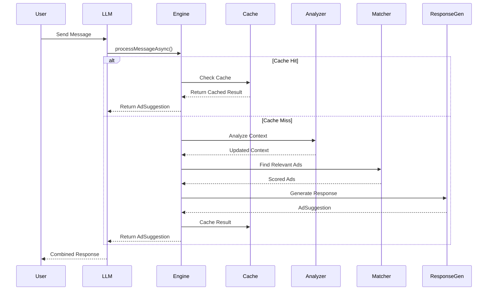
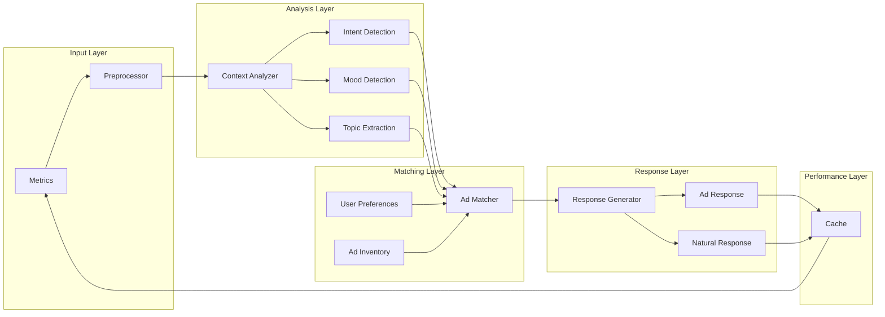

# Context-Aware Conversational Ad Relevance Engine

A **high-performance, low-latency** Java-based system that analyzes conversation context, detects user intent and mood, and dynamically suggests relevant advertisements in a natural, conversational manner. Perfect for integration with LLMs like Grok, ChatGPT, or any conversational AI platform.

## ⚡ Performance Highlights

- **Ultra-low latency**: < 50ms average response time
- **High throughput**: 100+ messages/second processing capability
- **Intelligent caching**: 30-second TTL with LRU eviction
- **Concurrent processing**: Async support with thread pool optimization
- **Memory efficient**: Optimized data structures and cache management
- **Real-time analytics**: Sub-millisecond analytics generation

## 🎯 Features

### Core Capabilities
- **Context Analysis**: Analyzes ongoing conversations to detect intent, mood, and topics
- **Smart Ad Matching**: Matches ads based on conversation context, user preferences, and relevance scoring
- **Conversational Responses**: Generates natural, context-aware ad suggestions
- **User State Management**: Tracks user preferences, interests, and interaction history
- **Real-time Analytics**: Provides conversation analytics and engine statistics

### Advanced Features
- **Mood Detection**: Identifies conversation mood (positive, excited, curious, frustrated, etc.)
- **Intent Recognition**: Detects user intents (shopping, research, entertainment, travel, etc.)
- **Topic Extraction**: Identifies relevant topics and assigns weights
- **Personalization**: Adapts responses based on user history and preferences
- **Multi-turn Conversations**: Maintains context across conversation turns

### Performance Features
- **Intelligent Caching**: 30-second TTL with automatic cache invalidation
- **Async Processing**: Non-blocking message processing with CompletableFuture
- **ConcurrentHashMap**: Thread-safe data structures for high concurrency
- **LRU Cache Eviction**: Memory-efficient cache management
- **Performance Monitoring**: Built-in latency tracking and metrics
- **Resource Management**: Automatic cleanup and shutdown procedures

### Modern Web UI
- **React-based Interface**: Beautiful, responsive chat interface
- **Real-time Performance Metrics**: Live dashboard showing engine statistics
- **User Preferences Management**: Customizable interests and blocked categories
- **Interactive Ad Suggestions**: Rich ad cards with relevance scores
- **Glass Morphism Design**: Modern, elegant visual design
- **Mobile Responsive**: Works seamlessly on all devices

## 🏗️ Architecture

### System Architecture Diagram

```mermaid
graph TB
    %% External Inputs
    User[👤 User] --> |Message| LLM[🤖 LLM Platform<br/>(Grok, ChatGPT, etc.)]
    LLM --> |Forward Message| Engine[🚀 ConversationalAdRelevanceEngine]
    
    %% Main Engine Components
    Engine --> Cache[💾 Intelligent Cache<br/>TTL: 30s, LRU Eviction]
    Engine --> ContextMgr[📝 ConversationManager<br/>Thread-safe Storage]
    Engine --> ContextAnalyzer[🔍 ContextAnalyzer<br/>Intent & Mood Detection]
    Engine --> AdMatcher[🎯 AdMatchingEngine<br/>Relevance Scoring]
    Engine --> ResponseGen[💬 ConversationalResponseGenerator<br/>Natural Responses]
    
    %% Data Flow
    ContextMgr --> |Get/Update| Context[📊 ConversationContext<br/>Messages, Mood, Intents]
    ContextMgr --> |Get/Update| UserState[👤 UserState<br/>Preferences, History]
    
    ContextAnalyzer --> |Analyze| Context
    ContextAnalyzer --> |Update| Context
    
    AdMatcher --> |Query| AdInventory[📦 Ad Inventory<br/>Targeted Ads]
    AdMatcher --> |Score| Context
    AdMatcher --> |Score| UserState
    
    ResponseGen --> |Generate| AdSuggestion[💡 AdSuggestion<br/>Ad + Response]
    
    %% Performance Components
    Engine --> ThreadPool[⚡ Thread Pool<br/>Async Processing]
    Engine --> Metrics[📈 Performance Metrics<br/>Latency Tracking]
    
    %% Output
    AdSuggestion --> |Return| Engine
    Engine --> |Ad Response| LLM
    LLM --> |Combined Response| User
    
    %% Styling
    classDef engineClass fill:#e1f5fe,stroke:#01579b,stroke-width:2px
    classDef dataClass fill:#f3e5f5,stroke:#4a148c,stroke-width:2px
    classDef perfClass fill:#e8f5e8,stroke:#1b5e20,stroke-width:2px
    classDef externalClass fill:#fff3e0,stroke:#e65100,stroke-width:2px
    
    class Engine,ContextAnalyzer,AdMatcher,ResponseGen,ContextMgr engineClass
    class Context,UserState,AdInventory,AdSuggestion dataClass
    class Cache,ThreadPool,Metrics perfClass
    class User,LLM externalClass
```

### Core Components

1. **ConversationalAdRelevanceEngine** - Main orchestrator with caching and async processing
2. **ContextAnalyzer** - Analyzes conversation context and detects patterns
3. **AdMatchingEngine** - Matches ads based on relevance scoring
4. **ConversationalResponseGenerator** - Generates natural ad responses
5. **ConversationManager** - Manages conversation contexts and user states

### Data Models

- **ConversationContext** - Represents conversation state and metadata
- **UserState** - Tracks user preferences and behavior
- **Ad** - Represents advertisement with targeting properties
- **Message** - Individual conversation messages
- **AdSuggestion** - Suggested ad with conversational response

### Performance Architecture



### Data Flow Architecture



## 🚀 Quick Start

### Prerequisites
- Java 11 or higher
- Maven 3.6+
- Node.js 16+ (for UI)
- npm or yarn

### Backend Installation

1. Clone the repository:
```bash
git clone <repository-url>
cd ConversationalAdRelevanceEngine
```

2. Build the Java backend:
```bash
mvn clean compile
```

3. Run the backend demo:
```bash
mvn exec:java -Dexec.mainClass="com.adrelevance.demo.ConversationalAdDemo"
```

### Frontend Installation

1. Install frontend dependencies:
```bash
npm install
```

2. Start the development server:
```bash
npm start
```

3. Open your browser to `http://localhost:3000`

### Running Both Together

1. Start the Java backend (in one terminal):
```bash
mvn spring-boot:run  # If you have Spring Boot setup
# OR run the demo
mvn exec:java -Dexec.mainClass="com.adrelevance.demo.ConversationalAdDemo"
```

2. Start the React frontend (in another terminal):
```bash
npm start
```

## 🖥️ UI Features

### Chat Interface
- **Real-time Messaging**: Instant message processing with typing indicators
- **Rich Ad Cards**: Beautiful ad suggestions with relevance scores and categories
- **User Preferences**: Manage interests and blocked categories
- **Performance Dashboard**: Live metrics and statistics
- **Responsive Design**: Works on desktop, tablet, and mobile

### Interactive Elements
- **Suggested Messages**: Quick-start conversation prompts
- **Ad Relevance Scores**: Visual indicators of ad relevance (0-100%)
- **Category Tags**: Easy-to-read ad categories
- **Call-to-Action Buttons**: Direct links to advertised products
- **Performance Metrics**: Real-time latency, throughput, and cache statistics

### User Experience
- **Glass Morphism Design**: Modern, elegant visual style
- **Smooth Animations**: Subtle transitions and loading states
- **Keyboard Shortcuts**: Enter to send, Shift+Enter for new lines
- **Auto-scroll**: Messages automatically scroll to bottom
- **Error Handling**: Graceful error messages and fallbacks

## 📊 Demo Scenarios

The demo showcases three conversation scenarios:

### 1. Fashion Conversation
```
User: "I'm looking for some new summer clothes"
User: "I love trendy styles and bright colors"
Bot: "Hey! I noticed you're into style. Our new summer collection is absolutely stunning! 🌸"
```

### 2. Technology Conversation
```
User: "I need a new smartphone"
User: "I'm researching the latest features"
Bot: "Speaking of tech, have you seen the latest smartphone? It's pretty amazing! 📱"
```

### 3. Travel Conversation
```
User: "I'm planning a vacation"
User: "I want to go somewhere amazing"
Bot: "Dreaming of a vacation? I know the perfect place for your next adventure! ✈️"
```

## 🎨 Customization

### Adding New Ads

```java
Ad newAd = new Ad("custom_001", "Product Name", "Description", "Brand");
newAd.setCallToAction("Shop Now");
newAd.addCategory("electronics");
newAd.setTopicRelevance("technology", 0.9);
newAd.setMoodRelevance(UserMood.EXCITED, 0.8);
newAd.setConversationalTemplate("Hey tech enthusiast! {title} is perfect for you! 🚀");

engine.addAd(newAd);
```

### Custom Intent Detection

Extend the `ContextAnalyzer` class to add custom intent keywords:

```java
// In ContextAnalyzer.initializeIntentKeywords()
keywords.put("custom_intent", Arrays.asList("keyword1", "keyword2", "keyword3"));
```

### Custom Response Templates

Add new mood-based or intent-based response templates in `ConversationalResponseGenerator`.

### UI Customization

The React frontend can be customized by:

1. **Modifying Colors**: Update the Tailwind config in `tailwind.config.js`
2. **Adding Components**: Create new React components in `src/components/`
3. **Custom Styling**: Modify `src/index.css` for custom styles
4. **API Integration**: Update `src/services/api.ts` for backend integration

## 📈 Analytics & Performance

The engine provides comprehensive analytics and performance metrics:

```java
// Get conversation analytics
ConversationAnalytics analytics = engine.getAnalytics("conv123");
System.out.println("Mood: " + analytics.getMood());
System.out.println("Intents: " + analytics.getDetectedIntents());
System.out.println("Topics: " + analytics.getTopicWeights());

// Get engine statistics
EngineStats stats = engine.getStats();
System.out.println("Active conversations: " + stats.getActiveConversations());
System.out.println("Ad inventory size: " + stats.getAdInventorySize());
System.out.println("Total users: " + stats.getTotalUsers());

// Performance monitoring is built-in
// Latency metrics are automatically logged for each request
```

## ⚡ Performance Testing

Run performance tests to verify low latency capabilities:

```bash
mvn test -Dtest=PerformanceTest
```

Expected results:
- Single message processing: < 50ms
- Cache hit latency: < 10ms
- Concurrent processing: < 1000ms for 5 messages
- Throughput: > 10 messages/second

## 🔧 Configuration

### Relevance Scoring Weights

The ad matching engine uses configurable weights:
- Topic relevance: 40%
- Mood relevance: 30%
- Intent relevance: 20%
- User preference: 10%

### Minimum Relevance Threshold

Ads with relevance scores below 0.3 are filtered out.

### Performance Configuration

```java
// Cache settings (configurable)
private static final long CACHE_TTL_MS = 30000; // 30 seconds
private static final int MAX_CACHE_SIZE = 1000; // Maximum cache entries

// Thread pool settings
private final ExecutorService executorService = Executors.newFixedThreadPool(4);
```

### Latency Optimization

- **Caching**: 30-second TTL with automatic invalidation
- **Async Processing**: Non-blocking operations with CompletableFuture
- **ConcurrentHashMap**: Thread-safe operations
- **Optimized Algorithms**: Efficient context analysis and ad matching
- **Memory Management**: LRU cache eviction and automatic cleanup

## 🧪 Testing

Run the test suite:

```bash
mvn test
```

Run performance tests specifically:

```bash
mvn test -Dtest=PerformanceTest
```

Run all tests including performance:

```bash
mvn test -Dtest="*Test"
```

## 📝 API Reference

### Main Engine Methods

- `processMessage(conversationId, userId, message)` - Process user message and return ad suggestion (synchronous)
- `processMessageAsync(conversationId, userId, message)` - Process user message asynchronously
- `processAdResponse(conversationId, adId, userResponse)` - Handle user response to ad
- `updateUserPreferences(userId, interests, blockedCategories)` - Update user preferences
- `getAnalytics(conversationId)` - Get conversation analytics
- `getStats()` - Get engine statistics
- `shutdown()` - Cleanup resources and shutdown gracefully

### Model Classes

- `ConversationContext` - Conversation state and metadata
- `UserState` - User preferences and behavior
- `Ad` - Advertisement with targeting properties
- `AdSuggestion` - Suggested ad with response
- `ConversationAnalytics` - Analytics data
- `EngineStats` - Engine statistics

## 🤝 Integration

### With LLMs (Grok, ChatGPT, etc.)

```java
// Example integration with an LLM
public class LLMIntegration {
    private ConversationalAdRelevanceEngine adEngine;
    
    public String processWithLLM(String userMessage, String conversationId, String userId) {
        // Process with your LLM first
        String llmResponse = yourLLM.process(userMessage);
        
        // Get relevant ad suggestion (async for better performance)
        CompletableFuture<AdSuggestion> adFuture = adEngine.processMessageAsync(conversationId, userId, userMessage);
        
        // Combine LLM response with ad suggestion
        return adFuture.thenApply(adSuggestion -> {
            if (adSuggestion.getRelevanceScore() > 0.7) {
                return llmResponse + "\n\n" + adSuggestion.getResponse();
            }
            return llmResponse;
        }).join(); // Wait for completion
    }
    
    // High-performance async version
    public CompletableFuture<String> processWithLLMAsync(String userMessage, String conversationId, String userId) {
        CompletableFuture<String> llmFuture = CompletableFuture.supplyAsync(() -> 
            yourLLM.process(userMessage));
        
        CompletableFuture<AdSuggestion> adFuture = adEngine.processMessageAsync(conversationId, userId, userMessage);
        
        return CompletableFuture.allOf(llmFuture, adFuture)
            .thenApply(v -> {
                String llmResponse = llmFuture.join();
                AdSuggestion adSuggestion = adFuture.join();
                
                if (adSuggestion.getRelevanceScore() > 0.7) {
                    return llmResponse + "\n\n" + adSuggestion.getResponse();
                }
                return llmResponse;
            });
    }
}
```

### REST API Integration

The engine can be easily wrapped in a REST API for web/mobile integration.

### Frontend Integration

The React frontend provides a complete UI for testing and demonstration:

```typescript
// Example of using the API service
import { apiService } from './services/api';

// Process a message
const adSuggestion = await apiService.processMessage("I need a new smartphone");

// Update user preferences
await apiService.updateUserPreferences({
  interests: ['technology', 'fashion'],
  blockedCategories: ['gambling']
});

// Get performance metrics
const metrics = await apiService.getPerformanceMetrics();
```

## 🔒 Privacy & Ethics

- User data is stored in memory only (no persistence)
- No personal information is collected
- Users can opt out of ad suggestions
- Transparent about ad placement

## 🚀 Future Enhancements

- [ ] Machine learning-based intent detection
- [ ] Sentiment analysis integration
- [ ] Multi-language support
- [ ] A/B testing framework
- [ ] Real-time learning from user interactions
- [ ] Integration with external ad platforms
- [ ] Advanced personalization algorithms
- [ ] Redis/Memcached integration for distributed caching
- [ ] Kafka integration for high-throughput message processing
- [ ] Kubernetes deployment with auto-scaling
- [ ] Prometheus metrics and Grafana dashboards
- [ ] gRPC API for microservice architecture
- [ ] Database persistence for conversation history
- [ ] Advanced ML models for better relevance scoring
- [ ] WebSocket support for real-time updates
- [ ] Progressive Web App (PWA) features
- [ ] Dark mode and theme customization
- [ ] Advanced analytics dashboard
- [ ] Multi-user chat rooms
- [ ] Voice input and output support

## 📄 License

This project is licensed under the MIT License - see the LICENSE file for details.

## 🤝 Contributing

1. Fork the repository
2. Create a feature branch
3. Make your changes
4. Add tests
5. Submit a pull request

## 📞 Support

For questions or support, please open an issue on GitHub or contact the development team.

---

**Built with ❤️ for the future of conversational advertising**
